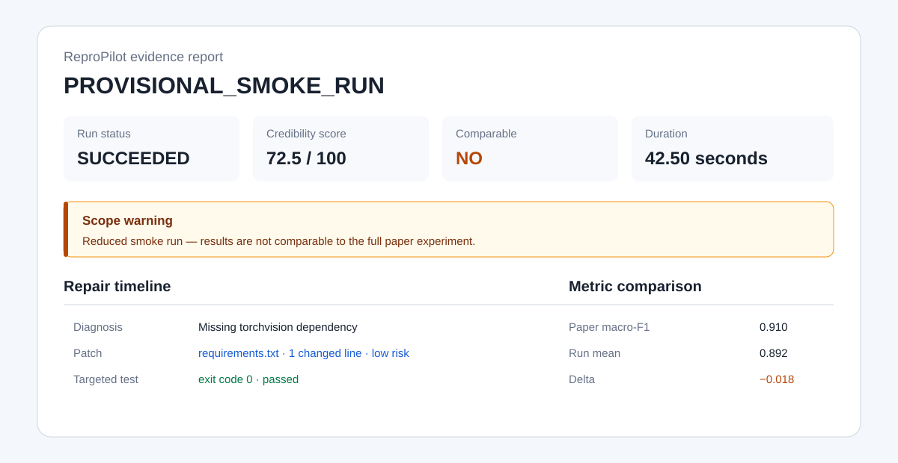

# ReproPilot

ReproPilot 是一个面向机器学习论文复现的代码执行与修复智能体。输入论文 PDF、GitHub/本地仓库、数据集目录和运行命令后，它会在受限 Docker 容器里执行项目，保存论文—代码差异、命令日志、诊断、Git diff、测试、指标对比和确定性可信度评分，最后生成单文件 HTML 证据报告。



> 当前是作品集级 MVP，聚焦 PyTorch 图像分类式工作流和 10–20 分钟缩小实验。`PROVISIONAL_SMOKE_RUN` 只证明执行闭环可用，不代表完整复现了论文结果。

## 它解决什么问题

普通论文问答只回答“论文写了什么”。ReproPilot 继续追问并执行：代码默认值是否一致、环境能否构建、最小命令能否运行、错误能否用最小补丁修复、修复是否通过测试，以及运行结果到底有多可信。

```text
PDF 证据解析 → 代码配置审计 → Docker 构建 → 冒烟运行
              → 诊断 → 风险判定 → 补丁/审批 → 测试
              → 指标比较 → 可信度评分 → HTML 报告
```

每次运行都在 `runs/<run-id>/` 保存证据。原始仓库和数据集以只读输入对待；补丁只应用于运行目录中的工作副本。

## 前置条件

- Windows 10/11、macOS 或 Linux。
- Python 3.11–3.13、Git。
- Docker Desktop（Windows/macOS）或 Docker Engine（Linux）。Windows 上 Docker Desktop 使用 WSL 2 后端。
- 一个 OpenAI 兼容 API 的 key、base URL（官方 OpenAI 可留空）和支持结构化输出的模型名。

先验证 Docker：

```powershell
docker version
docker run --rm hello-world
```

## 安装

Windows PowerShell：

```powershell
git clone https://github.com/yihanx082-cmd/ReproPilot.git
cd ReproPilot
py -3.11 -m venv .venv
.\.venv\Scripts\Activate.ps1
python -m pip install -e ".[dev]"
```

把密钥放在当前 PowerShell 会话中，不要提交 `.env`：

```powershell
$env:OPENAI_API_KEY="你的密钥"
$env:OPENAI_MODEL="支持结构化输出的模型名"
$env:OPENAI_BASE_URL="https://你的兼容服务/v1"  # 官方 OpenAI 可省略
```

DeepSeek 示例（JSON 模式由 ReproPilot 自动适配）：

```powershell
$env:OPENAI_API_KEY="你的 DeepSeek API Key"
$env:OPENAI_MODEL="deepseek-v4-pro"
$env:OPENAI_BASE_URL="https://api.deepseek.com"
```

API Key 只应保存在本机环境变量中，不要写入 YAML、源码、日志或提交到 GitHub。

可先只验证配置，不调用模型、不运行代码：

```powershell
repropilot run --config examples/cifar10-smoke.yaml --validate-only
```

## 一条命令运行

先复制并修改 [examples/cifar10-smoke.yaml](examples/cifar10-smoke.yaml) 中的 PDF、仓库和数据集绝对路径，然后运行：

```powershell
repropilot run --config examples/cifar10-smoke.yaml --output-root runs
```

成功或失败都会生成 `report.html`。查看状态与事件数：

```powershell
repropilot inspect runs\<run-id>
```

### 三随机种子正式实验

冒烟运行负责尽快发现并修复环境或代码错误；正式实验负责在同一个已修复工作副本中运行可审计的重复实验。参考 [examples/cifar10-formal.yaml](examples/cifar10-formal.yaml)：

```yaml
formal_experiment:
  command: [python, trainer.py, --seed, "{seed}"]
  seeds: [11, 22, 33]
  comparison_scope: paper
  scope_evidence:
    - paper_spec.json#reported_results[0]
```

`{seed}` 会被逐个替换，每次运行生成独立 JSON 和日志。`comparison_scope: paper` 必须同时给出可审计的证据引用；如果数据、模型或实验范围被缩小，应使用默认的 `reduced`，此时结果接近度不计分。报告会显示每个种子的命令与结果，以及指标的均值、标准差和论文差值。

真实 ResNet-20/CIFAR-10 端到端运行从论文 PDF 提取出 `8.75%` 的报告错误率，自动修复旧仓库的 CPU 兼容和缺失 checkpoint 元数据问题，并在 Docker 中完成三种子评估。观测结果为 `Error = 8.27 ± 0.00%`，相对论文低 `0.48` 个百分点，证据评分为 `80/100 (PARTIAL)`。这验证了“论文解析 → 配置审计 → 构建 → 修复 → 实验 → 对比 → 报告”闭环，但使用的是公开预训练权重评估，不等同于从头完成三次论文训练。完整记录见 [正式实验结果](docs/formal-demo-result.md)。

### 高风险补丁审批

指标、数据划分、模型、预训练权重等语义修改不会自动应用。运行暂停后：

```powershell
repropilot approve runs\<run-id> <patch-id>
repropilot resume runs\<run-id>
```

或记录拒绝理由并生成终止报告：

```powershell
repropilot reject runs\<run-id> <patch-id> --reason "数据划分语义不能自动修改"
repropilot resume runs\<run-id>
```

审批绑定补丁 SHA-256；补丁内容变化后，旧审批不能复用。

## 可信度评分

| 维度 | 权重 |
|---|---:|
| 环境完整性 | 15 |
| 数据一致性 | 20 |
| 配置一致性 | 20 |
| 指标一致性 | 15 |
| 随机种子完整性 | 10 |
| 结果接近程度 | 15 |
| 外部依赖可获得性 | 5 |

评分只使用确定性规则：`verified` 得满分，`partial` 得一半，`failed/unknown` 得 0；任何得分必须引用 artifact ID。缩小数据、减少 epoch 或更换模型会强制清零结果接近度，并标记为 `PROVISIONAL_SMOKE_RUN`。

## 评测集

项目保留两套用途不同的六案例评测。

确定性 reference harness 用已知注入的逆补丁验证评测管线、安全门和指标计算：

```powershell
python scripts/run_benchmark.py --cases benchmark/cases.yaml --output artifacts/benchmark
```

真实 Agent benchmark 固定 3 个开源 PyTorch 图像分类仓库的提交，注入依赖、路径、配置、指标、CUDA 和数据故障，再由模型生成未知补丁：

```powershell
python scripts/run_real_benchmark.py `
  --cases benchmark/real-projects.yaml `
  --output artifacts/real-agent-benchmark `
  --source-cache artifacts/pinned-sources `
  --approve-high-risk
```

2026-09-03 的 `deepseek-v4-pro` 基线中，6/6 案例定位正确、6/6 修复成功、6/6 修复后探针通过，无关改动率为 0%，共使用 6 次模型调用和 18,846 tokens。指标与数据类修改均正确经过高风险审批门。完整方法、逐案例结果和证据摘要见 [真实 Agent 基线](benchmark/real-baseline-summary.md)；reference harness 结果见 [确定性基线](benchmark/baseline-summary.md)。语义探针通过只证明有限范围内的代码修复成功，不代表完成了论文训练或复现了论文指标。

## 测试

```powershell
ruff check src tests scripts
mypy src
pytest -q
```

Docker 集成测试默认跳过；显式运行：

```powershell
$env:REPROPILOT_DOCKER_TESTS="1"
$env:REPROPILOT_DOCKER_BIN="C:\Program Files\Docker\Docker\resources\bin\docker.exe"
pytest tests/test_sandbox.py tests/test_orchestrator.py -v
```

Docker 可执行文件位置因安装方式而异，可省略 `REPROPILOT_DOCKER_BIN` 让系统从 `PATH` 查找。

## 成本与运行时间

- 论文解析通常调用模型一次；每次失败最多提出 3 个补丁。
- 默认总时限 20 分钟，Docker 限制为 2 CPU、2 GB 内存、256 个进程，无网络运行。
- 真实成本取决于模型价格、论文长度和补丁次数；报告会保存 token、耗时和可获得的成本证据。
- 六案例 reference 基线不调用模型，开发机墙钟时间约 25 秒；真实 Agent 基线的 6 次模型调用耗时约 54 秒。

## 威胁模型

目标仓库是不可信输入。ReproPilot 使用非 root 用户、只读根文件系统、只读原仓库/数据集挂载、可写工作副本、禁用网络、capability 全移除、`no-new-privileges`、资源限制和显式 argv。它不会挂载宿主 Docker socket，也不会执行模型生成的 shell 字符串。

仍需注意：Docker 不是形式化安全证明；镜像构建阶段可能访问依赖源；Git clone 和模型 API 发生在容器外；本 MVP 不自动接受数据许可、不管理云端凭据，也不执行未知高风险补丁。

## 明确限制

- 支持 3–10 个种子的顺序正式实验；MVP 尚不做并行 GPU 调度或超出 20 分钟边界的完整训练。
- 结果解析目前支持日志中的 `metric=value`/`metric: value`。
- 远程仓库、私有依赖和受限数据集仍需要用户提供访问权限。
- 论文声明抽取与补丁生成依赖所选模型；所有模型输出仍会经过本地证据验证和风险策略。
- 当前真实 Agent 基线只有 3 个仓库和 6 个单故障案例，适合证明闭环与安全策略，尚不足以代表对广泛未知项目的泛化能力。

详细设计见 [架构说明](docs/architecture.md)，演示录制见 [五分钟演示脚本](docs/demo-script.md)。
