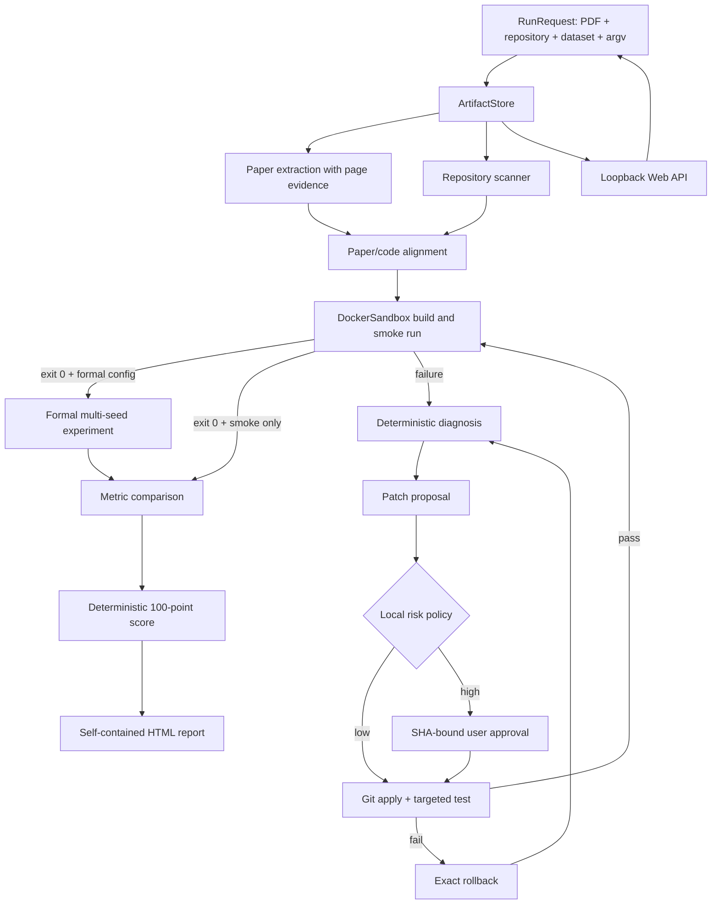

# ReproPilot Architecture

## 核心原则

ReproPilot 把大模型限制在两个需要语义理解的位置：从 PDF 提取结构化声明、根据已有诊断提出最小补丁。命令策略、补丁风险、Git 事务、评分和状态转换均由确定性代码控制。

## 状态与证据

`ReproPilot` 是显式状态机：`INGEST → AUDIT → BUILD → SMOKE_RUN → [FORMAL_EXPERIMENT] → COMPARE → SCORE → REPORT`。冒烟失败时进入 `DIAGNOSE → APPLY_PATCH → VERIFY` 修复循环；高风险补丁进入 `WAITING_APPROVAL`。正式实验是可选阶段，每个种子都有独立命令 artifact，失败会生成终止报告而不会扩大自动修复范围。

`run.json` 保存当前状态，`events.jsonl` 追加事件；其余 JSON、日志和 HTML 都是可定位的 artifact。状态转换先记录，再执行副作用，便于中断审计。

## 安全边界

| 层 | 约束 |
|---|---|
| CLI | Pydantic 校验配置；命令使用 argv，不经过 shell |
| Docker | 非 root、无网络、只读根、能力移除、CPU/内存/PID/超时限制 |
| 文件 | 原仓库与数据集只读；补丁只进入工作副本 |
| 补丁 | Git diff 校验、允许路径、诊断文件交集、最多 3 个文件/120 行 |
| 语义 | 数据、指标、模型、权重修改必须审批 |
| 事务 | 先保存工作区哈希；测试失败反向应用补丁并校验完全恢复 |
| 结论 | 缩小实验永远不能标记 `REPRODUCED` |
| Web | 只允许 `127.0.0.1`/`localhost`/`::1`；run ID 白名单；修改请求必须为 JSON |

## 模块映射

- `paper.py`：PDF 页面文本、结构化模型输出、逐页原文证据验证。
- `repository.py` / `alignment.py`：YAML、JSON、TOML、argparse、README 扫描与差异检测。
- `sandbox.py`：Docker CLI 隔离和日志脱敏。
- `diagnosis.py` / `policy.py` / `patching.py`：错误分类、风险门和 Git 事务。
- `orchestrator.py` / `services.py`：状态机与真实服务接线。
- `web.py`：回环地址上的薄 API 层；启动任务、读取持久化证据、记录 SHA 绑定审批并调用原状态机恢复。
- `scoring.py` / `reporting.py`：可信度评分和单文件 HTML 报告。
- `benchmark.py`：故障注入评测指标与 reference harness。
- `real_benchmark.py`：固定真实仓库获取、隐藏故障生命周期、模型修复评测与证据聚合。

## MVP 边界

本版本包含本地单用户 Web 控制台，但不包含云端执行、多 Agent、Kubernetes、完整 GPU 调度或自动数据许可处理。公开站点只有冻结演示数据；真实执行 API 只监听本机回环地址。真实 Agent 清单覆盖 5 个固定仓库中的 8 个单故障案例，已发布模型基线覆盖其中 3 个仓库、6 个案例；它优先证明一个小而完整、证据可追踪、安全边界明确的 Coding Agent 闭环。
