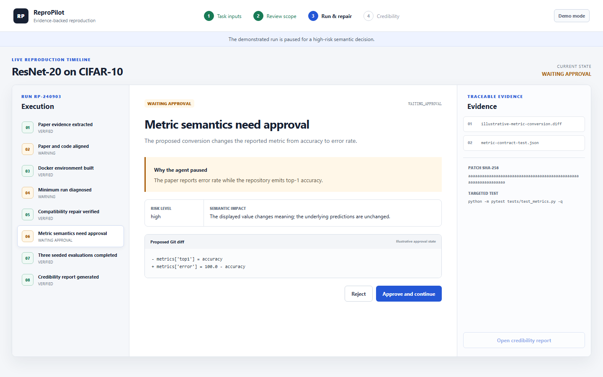
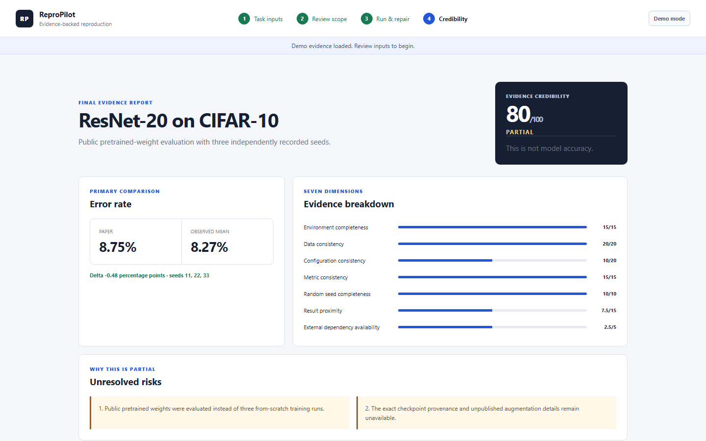

# ReproPilot：论文复现与代码修复智能体产品案例

## 一句话定位

ReproPilot 把“论文 PDF、代码仓库、数据集与环境信息”转成一条可审查的复现流程：对齐论文与代码、隔离运行、诊断故障、生成最小补丁、验证实验，并给出带证据边界的复现可信度报告。

## 1. 背景与问题

论文复现不是简单地执行一条训练命令。使用者需要在论文、README、配置文件、终端日志、代码 diff 和实验结果之间不断切换。最危险的情况不是程序报错，而是程序成功运行后，数据划分、指标口径或预训练权重已经偏离论文，却仍被误判为“复现成功”。

因此，本项目的产品目标不是替用户隐藏复杂性，而是把复杂过程组织成可理解、可追溯、可控制的证据链。

## 2. 目标用户

- 有基础 Python 或机器学习经验的研究生、研究人员与 ML 工程师；
- 手上已有论文、代码仓库和数据集，希望减少环境与排错成本；
- 能理解实验指标，但不一定熟悉 Docker、依赖冲突、安全补丁审查或复现方法学。

## 3. 用户研究状态

目前已经完成访谈提纲、知情说明、匿名化规则、5 位参与者记录模板和分析框架。真实访谈尚未开展，所有用户频率、耗时、满意度和可用性结论统一标记为：**Awaiting real participant responses**。

这个边界很重要：当前案例可以证明工程能力和产品假设，但不能用虚构数据证明用户需求已经验证。

## 4. 替代方案与机会

用户今天通常组合使用论文阅读工具、手工终端、代码编辑器、搜索引擎、实验追踪工具和通用 Coding Agent。它们分别解决阅读、执行或修复问题，但很少把论文声明、代码事实、补丁审批、测试证据和结果差异放进同一条复现工作流。

ReproPilot 的差异化不是“更会聊天”，而是面向论文复现的状态机和证据模型：每个结论都能回答做了什么、为什么做、证据在哪里、是否改变实验语义。

## 5. 产品决策

MVP 采用 CLI + 本地可点击 HTML 原型：

- CLI 负责真实执行、错误捕获、补丁、测试和 artifact 落盘；
- HTML 原型负责让使用者理解状态、审查高风险修改和阅读报告；
- Docker 提供隔离和可重复的执行环境；
- OpenAI 兼容接口让模型服务可替换；
- 首个领域限定为 PyTorch 图像分类，并使用缩小实验验证闭环。

产品刻意不做账号系统、云 GPU 调度、多用户协作和生产级远程任务管理，以避免作品集 MVP 失焦。

## 6. 核心工作流

```text
创建任务
  → 确认论文与代码范围
  → 环境构建与最小运行
  → 错误诊断与最小补丁
  → 测试验证与高风险审批
  → 正式实验与论文对比
  → 复现可信度报告
```

高风险修改必须暂停执行。界面同时展示根因、精确 diff、语义影响和针对性测试；用户决定与补丁 SHA-256 绑定，补丁变化后旧批准自动失效。

## 7. 可点击原型

原型包含 Task Creation、Scope Review、Execution Timeline、Approval 和 Credibility Report 五个状态。主路径可以完整点击，时间线左侧显示阶段，中间解释事件，右侧展示日志、diff、测试与 artifact 证据。

原型读取的是已去敏的冻结 fixture，不会在浏览器中真正解析论文、启动 Docker 或训练模型。这保证求职演示稳定，同时避免把模拟交互冒充实时运行。





## 8. Agent 工程评测

首轮评测覆盖 3 个小型仓库和 6 个单故障案例，包括依赖、路径、配置与指标类问题。已观测结果如下：

| 指标 | 结果 |
|---|---:|
| 错误定位 | 6/6 |
| 修复成功 | 6/6 |
| 修复后语义探针通过 | 6/6 |
| 无关代码修改率 | 0% |
| 模型调用 | 6 次 |
| Token | 18,846 |
| 工具调用 | 54 次 |
| Agent 墙钟时间 | 约 54 秒 |

这些数据只证明小型、单故障评测中的能力，不代表任意论文都能自动复现，也不等于完整训练成功。

## 9. 真实复现实验

在 ResNet-20/CIFAR-10 案例中，公开预训练 checkpoint 的观测 Error 为 `8.27% ± 0.00`，论文报告为 `8.75%`，差值为 `-0.48` 个百分点。系统给出 **80/100，PARTIAL**。

`80/100` 是复现证据可信度，不是模型准确率。`PARTIAL` 的主要原因是本次结果来自公开 checkpoint 评估，而不是三个随机种子下从头训练，因此不能把接近的数值表述为完整复现。

## 10. 产品度量计划

下一轮使用 5 位真实参与者开展探索性测试，记录：任务完成率、理解状态用时、人工步骤减少量、决策正确率、报告理解率和满意度。小样本只报告人数、中位数、范围和去身份化理由，不做总体外推或显著性结论。

成功标准包括至少 4/5 无帮助完成核心流程，以及至少 4/5 正确解释 `PARTIAL` 和可信度分数。

## 11. 当前限制

- 用户问题仍等待真实访谈验证；
- 工程评测规模仅为 3 个仓库、6 个单故障案例；
- 原型使用冻结数据，尚未动态连接 CLI artifacts；
- 真实实验采用公开 checkpoint，不是三随机种子从头训练；
- 未覆盖受限数据、集群调度和生产环境权限模型。

## 12. 下一轮迭代

先完成 5 位参与者访谈和可用性测试，再根据证据决定是否把 Web 层连接到真实 CLI。若用户普遍无法理解暂停原因，优先优化时间线与风险说明；若主要问题是输入成本，再设计仓库自动发现与任务模板，而不是提前扩展云端基础设施。

