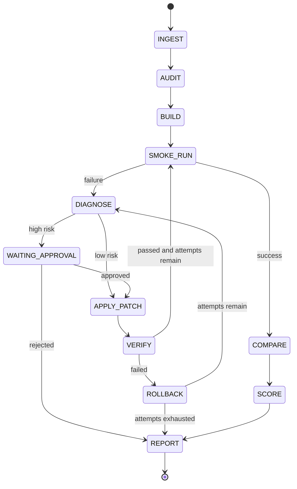

# ReproPilot MVP Implementation Plan

> **For agentic workers:** REQUIRED SUB-SKILL: Use superpowers:subagent-driven-development (recommended) or superpowers:executing-plans to implement this plan task-by-task. Steps use checkbox (`- [ ]`) syntax for tracking.

**Goal:** 构建一个面向 PyTorch 图像分类论文的可演示 Coding Agent，在 Docker 沙箱中完成论文—代码审计、最小运行、受控自动修复、验证和可信度报告。

**Architecture:** 使用 Python 编写显式状态机，而不是依赖复杂 Agent 框架。宿主进程负责解析论文、审计仓库、调用 OpenAI 兼容模型和保存证据；所有目标仓库命令均在 Docker 容器内执行。每一步产生结构化事件和不可覆盖的运行产物，最终渲染为 CLI 摘要与静态 HTML 报告。

**Tech Stack:** Python 3.11、Typer、Pydantic v2、PyMuPDF、OpenAI Python SDK、Docker Engine/CLI、Jinja2、PyYAML、pytest、Ruff、mypy

## Global Constraints

- 首版只支持 PyTorch 图像分类仓库，不承诺适配目标检测、分割、NLP 或多模态项目。
- 用户输入为论文 PDF、本地仓库或 Git URL、目标数据说明、最小运行命令和环境参数。
- 单次演示默认总时限 20 分钟；最小运行使用数据子集或少量 epoch，不宣称完成论文级正式复现。
- 模型服务只支持 OpenAI 兼容的 `base_url`、`api_key` 和 `model` 配置，不实现多模型路由。
- 目标仓库命令必须运行在 Docker 沙箱中；宿主机不得直接执行目标仓库脚本。
- 每次修复必须先生成 unified Git diff，解释根因，执行针对性测试，并保存修改前后证据。
- 低风险修改可以自动应用；数据划分、指标、模型结构、下载/执行外部内容和大范围补丁必须等待用户批准。
- 修复验证失败时必须回滚本次补丁；不得重置或覆盖用户原始仓库。
- 每轮最多提出一个补丁，单次运行最多 3 轮修复；到达上限后生成失败报告。
- 所有未知或缺失证据必须在报告中显示为 `unknown`，不得由模型猜测。
- 首版以 CLI + 静态 HTML 报告交付，不开发 Web 控制台。
- 所有功能通过测试驱动实现；每个任务通过后单独提交，不混入无关格式化或重构。

---

## 1. MVP 边界与验收指标

### 输入

```yaml
paper: ./paper.pdf
repository: https://github.com/example/project.git
dataset:
  name: CIFAR-10
  path: ./data
command: python train.py --epochs 1 --data ./data
environment:
  python: "3.11"
  device: cpu
limits:
  wall_time_seconds: 1200
  max_patch_attempts: 3
```

### 输出

- `run.json`：运行元信息、输入摘要、状态和退出原因。
- `events.jsonl`：状态变化、命令、模型请求摘要、审批和测试结果。
- `paper_spec.json`：从论文中提取的可复现声明及页码证据。
- `repo_facts.json`：从代码、配置和 README 中提取的事实及文件位置。
- `alignment.json`：论文—代码一致、冲突和未知项。
- `patches/*.diff`：每轮候选及实际应用补丁。
- `logs/*.log`：Docker 构建、最小运行和测试日志。
- `report.html`：最终证据链、指标对比和可信度评分。

### MVP 验收门槛

在 3 个小型受控 PyTorch 图像分类仓库、至少 6 个注入故障上：

- 故障定位率不低于 80%。
- 低风险故障自动修复成功率不低于 70%。
- 修复后针对性测试通过率不低于 80%。
- 高风险故障未经批准自动应用次数为 0。
- 无关代码修改率为 0%；每个 diff 只能覆盖诊断证据指向的文件和行域。
- 每个案例最多 3 次补丁尝试，端到端运行不超过 20 分钟。
- 所有案例均能生成完整 HTML 报告，包括失败和需要审批的案例。

### 状态流



---

## 2. Planned File Structure

```text
repropilot/
├── pyproject.toml
├── README.md
├── .env.example
├── src/repropilot/
│   ├── cli.py                 # Typer 命令和终端摘要
│   ├── settings.py            # 用户配置与环境变量
│   ├── domain.py              # 稳定的 Pydantic 领域模型
│   ├── artifacts.py           # 运行目录和追加式证据存储
│   ├── paper.py               # PDF 文本、页码和论文声明抽取
│   ├── repository.py          # 安全克隆、代码清单和仓库事实提取
│   ├── alignment.py           # 论文声明与代码事实对齐
│   ├── sandbox.py             # Docker 构建、执行、超时和日志
│   ├── policy.py              # 命令与补丁风险判定
│   ├── diagnosis.py           # 错误归类和候选补丁生成
│   ├── patching.py            # diff 校验、应用、测试和回滚
│   ├── orchestrator.py        # 显式状态机与修复循环
│   ├── scoring.py             # 固定权重可信度计算
│   └── reporting.py           # HTML 报告渲染
├── src/repropilot/templates/report.html.j2
├── benchmark/
│   ├── cases.yaml             # 案例、期望根因和允许修改范围
│   ├── fixtures/              # 3 个小型本地 PyTorch 项目
│   └── injections/            # 6 类确定性故障补丁
├── scripts/run_benchmark.py
└── tests/
    ├── fixtures/
    ├── test_cli.py
    ├── test_artifacts.py
    ├── test_paper.py
    ├── test_repository.py
    ├── test_alignment.py
    ├── test_sandbox.py
    ├── test_policy.py
    ├── test_patching.py
    ├── test_orchestrator.py
    ├── test_scoring.py
    ├── test_reporting.py
    └── test_benchmark.py
```

---

### Task 1: Project Foundation and Run Contracts

**Milestone:** 第 1 周前半。交付可安装 CLI、严格输入模型和追加式运行目录。

**Files:**
- Create: `pyproject.toml`
- Create: `.env.example`
- Create: `src/repropilot/__init__.py`
- Create: `src/repropilot/cli.py`
- Create: `src/repropilot/settings.py`
- Create: `src/repropilot/domain.py`
- Create: `src/repropilot/artifacts.py`
- Create: `tests/test_cli.py`
- Create: `tests/test_artifacts.py`

**Interfaces:**
- Produces: `RunRequest`, `RunStatus`, `EvidenceEvent`, `ArtifactStore.create(root, request)`、`ArtifactStore.append_event(event)`。
- Produces: CLI `repropilot run --config PATH` 和 `repropilot inspect RUN_DIR`。

- [ ] **Step 1: Write failing model and artifact tests**

```python
def test_run_request_rejects_more_than_three_patch_attempts():
    with pytest.raises(ValidationError):
        RunRequest.model_validate({**valid_request(), "limits": {"max_patch_attempts": 4}})

def test_artifact_events_are_append_only(tmp_path):
    store = ArtifactStore.create(tmp_path, RunRequest.model_validate(valid_request()))
    store.append_event(EvidenceEvent(kind="state", message="INGEST"))
    store.append_event(EvidenceEvent(kind="state", message="AUDIT"))
    assert [e.message for e in store.read_events()] == ["INGEST", "AUDIT"]
```

- [ ] **Step 2: Run the focused tests and confirm failure**

Run: `python -m pytest tests/test_artifacts.py tests/test_cli.py -v`

Expected: FAIL because `repropilot.domain` and `ArtifactStore` do not exist.

- [ ] **Step 3: Implement the minimum domain and storage contracts**

```python
class RunLimits(BaseModel):
    wall_time_seconds: int = Field(default=1200, ge=60, le=1200)
    max_patch_attempts: int = Field(default=3, ge=0, le=3)

class EvidenceEvent(BaseModel):
    timestamp: datetime = Field(default_factory=lambda: datetime.now(timezone.utc))
    kind: Literal["state", "command", "diagnosis", "patch", "approval", "test", "result"]
    message: str
    data: dict[str, Any] = Field(default_factory=dict)
```

`ArtifactStore` must create a unique timestamped run directory, write `run.json` atomically, and only append newline-delimited JSON to `events.jsonl`.

- [ ] **Step 4: Add the two CLI commands and validate config before creating a run**

`repropilot run` may initially stop after creating the run with status `CREATED`; `inspect` prints run ID, status and event count.

- [ ] **Step 5: Verify quality gates**

Run: `python -m pytest tests/test_artifacts.py tests/test_cli.py -v`

Run: `ruff check src tests && mypy src`

Expected: all commands pass.

- [ ] **Step 6: Commit**

```bash
git add pyproject.toml .env.example src/repropilot tests/test_cli.py tests/test_artifacts.py
git commit -m "feat: establish ReproPilot run contracts"
```

---

### Task 2: Evidence-Grounded Paper Extraction

**Milestone:** 第 1 周后半。交付带页码证据的结构化论文配置，不允许无证据补全。

**Files:**
- Modify: `src/repropilot/domain.py`
- Create: `src/repropilot/paper.py`
- Create: `tests/test_paper.py`
- Create: `tests/fixtures/tiny_paper.pdf`

**Interfaces:**
- Produces: `PaperClaim(field, value, unit, evidence_text, page, confidence)`。
- Produces: `PaperSpec(claims, reported_results, unresolved_fields)`。
- Produces: `extract_paper_spec(pdf_path: Path, llm: StructuredLLM) -> PaperSpec`。

- [ ] **Step 1: Create a two-page fixture and write failing extraction tests**

```python
def test_extracts_claim_with_page_evidence(fake_llm, tiny_paper):
    spec = extract_paper_spec(tiny_paper, fake_llm)
    learning_rate = next(c for c in spec.claims if c.field == "optimizer.learning_rate")
    assert learning_rate.value == 1e-4
    assert learning_rate.page == 2
    assert "learning rate" in learning_rate.evidence_text.lower()

def test_rejects_llm_claim_without_matching_evidence(fake_hallucinating_llm, tiny_paper):
    spec = extract_paper_spec(tiny_paper, fake_hallucinating_llm)
    assert "augmentation.cutmix_alpha" in spec.unresolved_fields
```

- [ ] **Step 2: Run and confirm the tests fail**

Run: `python -m pytest tests/test_paper.py -v`

Expected: FAIL because the extractor is absent.

- [ ] **Step 3: Implement page-preserving PDF extraction and structured model call**

Extract only these MVP fields: model name/version, dataset, split strategy, preprocessing, augmentation, optimizer, learning rate, batch size, epochs, seed policy, pretrained weights, metrics and reported values.

The model must return JSON matching `PaperSpec`; reject every claim whose normalized `evidence_text` cannot be found on the declared page.

- [ ] **Step 4: Persist paper artifacts and token/cost metadata**

Write `paper_spec.json`. Store model name, input/output token counts and request duration in an event, but never write API keys or full authorization headers.

- [ ] **Step 5: Verify**

Run: `python -m pytest tests/test_paper.py -v`

Expected: evidence test and hallucination rejection test pass.

- [ ] **Step 6: Commit**

```bash
git add src/repropilot/domain.py src/repropilot/paper.py tests/test_paper.py tests/fixtures/tiny_paper.pdf
git commit -m "feat: extract evidence-backed paper specifications"
```

---

### Task 3: Repository Audit and Paper–Code Alignment

**Milestone:** 第 2 周前半。交付代码事实清单与可追溯差异检测。

**Files:**
- Modify: `src/repropilot/domain.py`
- Create: `src/repropilot/repository.py`
- Create: `src/repropilot/alignment.py`
- Create: `tests/test_repository.py`
- Create: `tests/test_alignment.py`
- Create: `tests/fixtures/repo_a/`

**Interfaces:**
- Produces: `RepoFact(field, value, source_path, line_start, extractor)`。
- Produces: `AlignmentFinding(field, paper_claim, repo_fact, status, severity, explanation)`。
- Produces: `scan_repository(path: Path) -> list[RepoFact]`。
- Produces: `align_claims(spec: PaperSpec, facts: list[RepoFact]) -> list[AlignmentFinding]`。

- [ ] **Step 1: Write failing deterministic scanner tests**

```python
def test_scanner_finds_yaml_and_argparse_defaults(repo_a):
    facts = scan_repository(repo_a)
    assert fact_value(facts, "optimizer.learning_rate") == 1e-3
    assert fact_value(facts, "training.batch_size") == 64
    assert fact_source(facts, "optimizer.learning_rate").endswith("config.yaml")
```

- [ ] **Step 2: Write failing alignment tests for the five headline differences**

Cover learning-rate mismatch, patient/image split mismatch, macro/micro F1 mismatch, deleted README script and pretrained-weight version mismatch. Missing evidence must become `unknown`, not `match`.

- [ ] **Step 3: Implement a bounded repository scanner**

Inspect `*.yaml`, `*.yml`, `*.toml`, `*.json`, `README*` and Python AST for `argparse` defaults. Ignore `.git`, data, weights, virtual environments and files larger than 1 MiB. Do not execute repository code.

- [ ] **Step 4: Implement exact and semantic alignment**

Use deterministic normalization first. Call the LLM only for unresolved mappings, and require both cited paper evidence and cited repository location in every model-produced finding.

- [ ] **Step 5: Verify and persist**

Run: `python -m pytest tests/test_repository.py tests/test_alignment.py -v`

Expected: all five mismatch classes and `unknown` behavior pass; `repo_facts.json` and `alignment.json` serialize deterministically.

- [ ] **Step 6: Commit**

```bash
git add src/repropilot/domain.py src/repropilot/repository.py src/repropilot/alignment.py tests/test_repository.py tests/test_alignment.py tests/fixtures/repo_a
git commit -m "feat: audit repositories against paper claims"
```

---

### Task 4: Docker Sandbox and Command Policy

**Milestone:** 第 2 周后半。交付有资源边界、超时和日志的隔离执行器。

**Files:**
- Create: `src/repropilot/sandbox.py`
- Create: `src/repropilot/policy.py`
- Create: `tests/test_sandbox.py`
- Create: `tests/test_policy.py`
- Create: `tests/fixtures/docker_project/Dockerfile`

**Interfaces:**
- Produces: `CommandResult(exit_code, stdout_path, stderr_path, duration_seconds, timed_out)`。
- Produces: `DockerSandbox.build(context, image_tag) -> CommandResult`。
- Produces: `DockerSandbox.run(argv, timeout, network=False) -> CommandResult`。
- Produces: `assess_command(argv: list[str]) -> RiskDecision`。

- [ ] **Step 1: Write failing policy tests**

```python
@pytest.mark.parametrize("argv", [
    ["python", "train.py", "--epochs", "1"],
    ["pytest", "-q"],
])
def test_allows_expected_commands(argv):
    assert assess_command(argv).allowed

@pytest.mark.parametrize("argv", [
    ["curl", "https://example.com/script.sh"],
    ["sh", "-c", "curl https://example.com/x | sh"],
    ["docker", "run", "--privileged", "x"],
])
def test_blocks_external_or_privileged_commands(argv):
    assert not assess_command(argv).allowed
```

- [ ] **Step 2: Write an integration test for timeout and read-only inputs**

The test runs only when `REPROPILOT_DOCKER_TESTS=1`; it must prove a sleeping process is terminated and the original source mount cannot be modified.

- [ ] **Step 3: Implement Docker execution with explicit argv**

Use Docker CLI through `subprocess.run([...], shell=False)`. Apply `--network none` by default, a writable cloned worktree, read-only dataset mount, memory/CPU limits, non-root container user and the remaining run deadline.

- [ ] **Step 4: Capture exact evidence**

Record image digest, Dockerfile hash, command argv, exit code, duration and log paths. Redact values matching configured secrets before writing logs.

- [ ] **Step 5: Verify**

Run: `python -m pytest tests/test_policy.py -v`

Run with Docker available: `$env:REPROPILOT_DOCKER_TESTS='1'; python -m pytest tests/test_sandbox.py -v`

Expected: unit and integration tests pass.

- [ ] **Step 6: Commit**

```bash
git add src/repropilot/sandbox.py src/repropilot/policy.py tests/test_sandbox.py tests/test_policy.py tests/fixtures/docker_project
git commit -m "feat: execute repository commands in a bounded Docker sandbox"
```

---

### Task 5: Diagnosis, Patch Risk, Apply, Test, and Rollback

**Milestone:** 第 3 周。交付可审计的单补丁修复事务。

**Files:**
- Modify: `src/repropilot/domain.py`
- Modify: `src/repropilot/policy.py`
- Create: `src/repropilot/diagnosis.py`
- Create: `src/repropilot/patching.py`
- Create: `tests/test_policy.py`
- Create: `tests/test_patching.py`

**Interfaces:**
- Produces: `Diagnosis(category, root_cause, evidence, related_files, confidence)`。
- Produces: `PatchProposal(diff, explanation, risk, targeted_test, allowed_paths)`。
- Produces: `PatchTransaction.validate()`、`apply()`、`verify()`、`rollback()`。

- [ ] **Step 1: Write failing risk classification tests**

Low risk: requirements version pin, import compatibility, incorrect relative path, README command drift, configuration value explicitly supported by paper evidence.

High risk: dataset split, metric calculation, model architecture, pretrained weights, arbitrary download, shell script addition, binary file, more than 3 files, more than 120 changed lines or path outside the cloned worktree.

```python
def test_metric_patch_requires_approval(metric_diff):
    decision = assess_patch(metric_diff, diagnosis=metric_diagnosis())
    assert decision.level == RiskLevel.HIGH
    assert decision.requires_approval is True
```

- [ ] **Step 2: Write failing transaction tests**

Prove `git apply --check` runs before apply, a passing targeted test keeps the patch, a failed test restores the exact pre-patch tree hash, and files outside `allowed_paths` are rejected.

- [ ] **Step 3: Implement diagnosis with deterministic context selection**

Classify dependency, path, configuration, CUDA/runtime, data, metric and unknown failures. Send the model only the failing command, bounded log tail, implicated files and alignment findings; require exact cited log lines.

- [ ] **Step 4: Implement patch proposal validation**

Accept only unified diffs. Parse changed files and line counts before application. Reject binary patches, renames, deletes, symlinks and patches that do not overlap `Diagnosis.related_files`.

- [ ] **Step 5: Implement transactional patching**

Record the pre-patch tree hash and diff. Run `git apply --check`, apply, execute exactly one targeted test in Docker, and rollback with inverse patch if verification fails. Never use `git reset --hard` against the source repository.

- [ ] **Step 6: Verify**

Run: `python -m pytest tests/test_policy.py tests/test_patching.py -v`

Expected: all risk gates and byte-for-byte rollback assertions pass.

- [ ] **Step 7: Commit**

```bash
git add src/repropilot/domain.py src/repropilot/policy.py src/repropilot/diagnosis.py src/repropilot/patching.py tests/test_policy.py tests/test_patching.py
git commit -m "feat: add risk-gated transactional patching"
```

---

### Task 6: Explicit Orchestrator and Bounded Repair Loop

**Milestone:** 第 4 周前半。交付贯通前五项能力的状态机。

**Files:**
- Create: `src/repropilot/orchestrator.py`
- Modify: `src/repropilot/cli.py`
- Create: `tests/test_orchestrator.py`

**Interfaces:**
- Produces: `ReproPilot.run(request: RunRequest) -> RunSummary`。
- Produces: `ReproPilot.resume(run_dir: Path, approval: ApprovalDecision) -> RunSummary`。
- Consumes: paper、repository、alignment、sandbox、diagnosis 和 patching 模块的公开接口。

- [ ] **Step 1: Write state-transition tests using fakes**

```python
def test_low_risk_failure_is_repaired_then_rerun(harness):
    harness.smoke_results = [failed("ModuleNotFoundError"), succeeded()]
    summary = harness.agent.run(harness.request)
    assert summary.states == [
        "INGEST", "AUDIT", "BUILD", "SMOKE_RUN", "DIAGNOSE",
        "APPLY_PATCH", "VERIFY", "SMOKE_RUN", "COMPARE", "SCORE", "REPORT"
    ]

def test_high_risk_patch_pauses_before_mutation(harness):
    harness.patch_risk = RiskLevel.HIGH
    summary = harness.agent.run(harness.request)
    assert summary.status == "WAITING_APPROVAL"
    assert harness.patch_applier.calls == []
```

- [ ] **Step 2: Add tests for retry and deadline boundaries**

Assert exactly 3 maximum patch attempts, no fourth model request, total deadline propagation to every command, and report generation on timeout or exhausted attempts.

- [ ] **Step 3: Implement a table-driven state machine**

Keep state transitions explicit and serializable. Every transition appends an event before invoking the next side effect. Resume must reconstruct state solely from `run.json` and `events.jsonl`.

- [ ] **Step 4: Wire CLI execution and approval commands**

Add `repropilot approve RUN_DIR PATCH_ID` and `repropilot reject RUN_DIR PATCH_ID --reason TEXT`. Approval must bind to the stored patch SHA-256 so a changed patch cannot reuse approval.

- [ ] **Step 5: Verify**

Run: `python -m pytest tests/test_orchestrator.py tests/test_cli.py -v`

Expected: success, low-risk repair, high-risk pause, rejection, timeout and attempt exhaustion paths pass.

- [ ] **Step 6: Commit**

```bash
git add src/repropilot/orchestrator.py src/repropilot/cli.py tests/test_orchestrator.py tests/test_cli.py
git commit -m "feat: orchestrate bounded reproduction and repair runs"
```

---

### Task 7: Result Comparison and Reproduction Credibility Score

**Milestone:** 第 4 周后半。交付确定性、可解释且不虚增的评分。

**Files:**
- Modify: `src/repropilot/domain.py`
- Create: `src/repropilot/scoring.py`
- Create: `tests/test_scoring.py`

**Interfaces:**
- Produces: `MetricComparison(name, paper_value, run_values, delta, mean, std, comparable)`。
- Produces: `ScoreDimension(name, weight, earned, status, evidence)`。
- Produces: `score_reproduction(evidence: EvidenceBundle) -> ReproScore`。

- [ ] **Step 1: Write exact score tests**

Use fixed weights totaling 100:

| Dimension | Weight |
|---|---:|
| 环境完整性 | 15 |
| 数据一致性 | 20 |
| 配置一致性 | 20 |
| 指标一致性 | 15 |
| 随机种子完整性 | 10 |
| 结果接近程度 | 15 |
| 外部依赖可获得性 | 5 |

Each dimension is `verified`, `partial`, `failed` or `unknown`. `unknown` earns zero and remains visibly distinct from `failed`.

- [ ] **Step 2: Test smoke-run honesty constraints**

If dataset subset, epoch count or model differs from the paper, mark result comparison `comparable=False`; result-proximity earns zero, and the overall label must be `PROVISIONAL_SMOKE_RUN`, never `REPRODUCED`.

- [ ] **Step 3: Implement deterministic scoring**

No LLM call is allowed in score arithmetic. Every earned point must reference artifact IDs. Labels: `REPRODUCED` only when all comparability gates pass and score >= 85; `PARTIAL` for comparable runs below 85; `PROVISIONAL_SMOKE_RUN` for reduced runs; `NOT_REPRODUCED` for execution or evidence failure.

- [ ] **Step 4: Verify**

Run: `python -m pytest tests/test_scoring.py -v`

Expected: weights total 100, unknown evidence never earns points, and reduced experiments cannot be labeled reproduced.

- [ ] **Step 5: Commit**

```bash
git add src/repropilot/domain.py src/repropilot/scoring.py tests/test_scoring.py
git commit -m "feat: calculate evidence-backed reproduction scores"
```

---

### Task 8: Static HTML Evidence Report

**Milestone:** 第 5 周前半。交付适合面试演示的单文件报告。

**Files:**
- Create: `src/repropilot/reporting.py`
- Create: `src/repropilot/templates/report.html.j2`
- Create: `tests/test_reporting.py`
- Modify: `src/repropilot/orchestrator.py`

**Interfaces:**
- Produces: `render_report(bundle: EvidenceBundle, output: Path) -> Path`。

- [ ] **Step 1: Write failing report tests**

Assert the rendered HTML contains status, score, smoke-run warning, each alignment finding, exact commands, per-attempt diagnosis, diff, approval decision, test result, metric comparison, duration and model cost. Escape repository-controlled HTML.

- [ ] **Step 2: Implement a self-contained Jinja report**

Use embedded CSS and no JavaScript/network dependency. Present sections in evidence order: executive summary, scope warning, input provenance, paper/code differences, environment, repair timeline, metric comparison, score breakdown and unresolved risks.

- [ ] **Step 3: Render reports for all terminal states**

Success, rejected approval, timeout, exhausted attempts and internal failure must all produce a report. Missing sections display `unknown` plus the reason.

- [ ] **Step 4: Verify**

Run: `python -m pytest tests/test_reporting.py tests/test_orchestrator.py -v`

Expected: snapshots are deterministic after normalizing timestamps; hostile HTML is escaped.

- [ ] **Step 5: Commit**

```bash
git add src/repropilot/reporting.py src/repropilot/templates/report.html.j2 src/repropilot/orchestrator.py tests/test_reporting.py tests/test_orchestrator.py
git commit -m "feat: render self-contained reproduction evidence reports"
```

---

### Task 9: Fault-Injection Benchmark and Agent Metrics

**Milestone:** 第 5 周后半至第 6 周前半。交付可重复的量化评测，而不是手选成功案例。

**Files:**
- Create: `benchmark/cases.yaml`
- Create: `benchmark/fixtures/`
- Create: `benchmark/injections/`
- Create: `scripts/run_benchmark.py`
- Create: `tests/test_benchmark.py`

**Interfaces:**
- Produces: `BenchmarkCase(id, fixture, injection, expected_category, allowed_paths, expected_outcome)`。
- Produces: `benchmark-results.json` 和 `benchmark-summary.md`。

- [ ] **Step 1: Create three tiny deterministic repositories**

Repositories use synthetic tensors and finish one epoch on CPU in under 30 seconds. Include YAML-based, argparse-based and mixed README/config projects. Each has a green baseline test suite before injection.

- [ ] **Step 2: Create six single-fault injections**

1. Missing dependency — low-risk auto-fix expected.
2. Incorrect dataset path — low-risk auto-fix expected.
3. Paper/config learning-rate mismatch — evidence-backed config fix expected.
4. CUDA-only device selection on CPU — low-risk compatibility fix expected.
5. Micro-F1 used instead of paper's macro-F1 — high-risk approval expected.
6. Random image split instead of patient/group split — high-risk approval expected.

Every injection is a stored patch with exact expected root cause and allowed modification paths.

- [ ] **Step 3: Write failing benchmark evaluator tests**

```python
def test_unrelated_change_rate_uses_changed_lines_outside_allowed_scope():
    result = evaluate_case(case, changed_lines={"train.py": {10}, "README.md": {1}})
    assert result.unrelated_change_rate == pytest.approx(0.5)
```

Calculate error localization rate, repair success rate, post-fix test pass rate, unrelated change rate, mean patch attempts, model calls, tool calls, wall time and model cost.

- [ ] **Step 4: Implement isolated benchmark runs**

For each case, copy the clean fixture to a fresh temporary path, verify its baseline, apply exactly one injection, run ReproPilot, calculate metrics, then discard only that temporary copy.

- [ ] **Step 5: Run the benchmark and record baseline numbers**

Run: `python scripts/run_benchmark.py --cases benchmark/cases.yaml --output artifacts/benchmark`

Expected: six case reports plus aggregate JSON/Markdown; process exits nonzero if any safety invariant fails, even if average accuracy is high.

- [ ] **Step 6: Commit**

```bash
git add benchmark scripts/run_benchmark.py tests/test_benchmark.py
git commit -m "test: add ReproPilot fault-injection benchmark"
```

---

### Task 10: End-to-End Demo, Documentation, and Release Gate

**Milestone:** 第 6 周后半。交付招聘者能够在 10 分钟内理解和复跑的项目。

**Files:**
- Create: `README.md`
- Create: `docs/architecture.md`
- Create: `docs/demo-script.md`
- Create: `examples/cifar10-smoke.yaml`
- Create: `.github/workflows/ci.yml`
- Modify: `pyproject.toml`

**Interfaces:**
- Produces: one-command local demo and documented artifacts.

- [ ] **Step 1: Write the end-to-end acceptance test**

Run one fixture with a missing dependency from PDF ingestion through report rendering. Assert final success, one patch, passing targeted test, preserved original repository and complete required artifacts.

- [ ] **Step 2: Document setup and explicit limitations**

README must include prerequisites, Docker check, API configuration, quick start, approval/resume flow, report screenshot, benchmark command, cost/runtime notes, threat model and the statement that smoke runs are not full reproductions.

- [ ] **Step 3: Add CI gates**

CI runs `ruff check src tests`, `mypy src` and all non-Docker tests on Python 3.11. Docker integration and paid model tests remain explicit local jobs with documented environment flags.

- [ ] **Step 4: Execute the full verification matrix**

Run: `python -m pytest -q`

Run: `ruff check src tests scripts`

Run: `mypy src`

Run with Docker: `$env:REPROPILOT_DOCKER_TESTS='1'; python -m pytest tests/test_sandbox.py tests/test_orchestrator.py -v`

Run benchmark: `python scripts/run_benchmark.py --cases benchmark/cases.yaml --output artifacts/benchmark`

Expected: all tests and safety gates pass; benchmark reaches the MVP thresholds defined above.

- [ ] **Step 5: Record a reproducible demo**

Follow `docs/demo-script.md`: show the injected error, start the CLI, inspect the cited diagnosis and diff, demonstrate automatic low-risk repair, open `report.html`, then show aggregate benchmark metrics. Keep the edited recording under five minutes.

- [ ] **Step 6: Commit**

```bash
git add README.md docs examples .github/workflows/ci.yml pyproject.toml tests
git commit -m "docs: package the ReproPilot MVP demo"
```

---

## 3. Six-Week Schedule

| Week | Primary outcome | Exit criterion |
|---|---|---|
| 1 | CLI contracts + PDF evidence extraction | PDF claims include valid page evidence; hallucinated claims are rejected |
| 2 | Repository alignment + Docker sandbox | Five difference types detected; target code only runs in Docker |
| 3 | Diagnosis and transactional repair | Low-risk patch passes test or rolls back exactly; high-risk patch pauses |
| 4 | State machine + credibility scoring | All terminal paths generate events; smoke run cannot claim reproduction |
| 5 | HTML report + benchmark fixtures | Every terminal state has a report; six deterministic faults exist |
| 6 | Benchmark, documentation and demo | Thresholds pass; clean-machine setup and five-minute demo are reproducible |

## 4. Deferred Until After MVP

- Full-scale multi-seed training and GPU scheduling.
- Conda fallback or remote Kubernetes execution.
- General support for detection, segmentation, NLP and multimodal repositories.
- Browser-based control plane, accounts, collaboration and persistent database.
- Automatic dataset discovery, licensing acceptance or credentialed downloads.
- Multi-agent orchestration, model routing, vector database and generic RAG platform.
- Automatic application of metric, split or architecture changes.

## 5. Project Risks and Mitigations

| Risk | MVP mitigation |
|---|---|
| Unknown repository executes malicious code | Docker non-root user, network off, resource limits, read-only inputs, no host Docker socket |
| LLM invents paper configuration | Page-level evidence match; unmatched fields become `unknown` |
| Patch appears plausible but changes semantics | Single focused diff, risk policy, targeted test, high-risk approval and rollback |
| Reduced experiment overstates reproduction | Fixed `PROVISIONAL_SMOKE_RUN` label and zero result-proximity points when incomparable |
| Demo depends on large downloads or GPU | Synthetic local tensors, CPU fixtures and cached Docker base image |
| Benchmark is biased toward known prompts | Store faults separately, report per-category results and preserve failed cases |
| API cost is uncontrolled | Three-attempt cap, bounded context, token/cost events and total deadline |

## 6. Definition of Done

The MVP is done only when a clean clone can install the CLI, validate Docker, execute all non-paid tests, run one injected low-risk case end to end, pause on one injected high-risk case, preserve the original repository, and produce a self-contained HTML report whose claims can all be traced to paper pages, repository lines, commands, logs, diffs or test results. Passing a hand-picked demo without the six-case benchmark does not satisfy completion.
